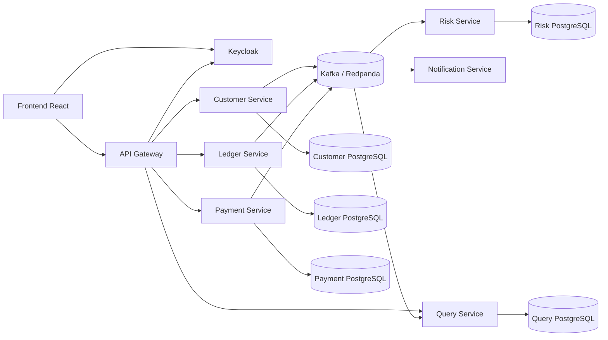

# Roadmap para construir un core bancario orientado a eventos

La mejor forma de abordar este proyecto es diseñarlo como una **plataforma bancaria educativa**, manteniendo principios reales: contabilidad de doble partida, trazabilidad, consistencia, idempotencia, seguridad y auditoría.

Mi recomendación es comenzar con pocos servicios bien delimitados y evitar crear demasiados microservicios desde el primer día.

## 1. Alcance inicial del proyecto

El primer producto funcional debería permitir:

1. Registrar y autenticar usuarios.
2. Crear clientes bancarios.
3. Abrir cuentas.
4. Depositar fondos.
5. Realizar transferencias entre cuentas.
6. Consultar saldos y movimientos.
7. Revertir operaciones mediante transacciones compensatorias.
8. Enviar notificaciones.
9. Mantener auditoría completa.
10. Detectar operaciones sospechosas mediante reglas simples.

No incluiría inicialmente:

- Tarjetas.
- Préstamos.
- Integración con bancos reales.
- Cambio de divisas.
- Procesamiento masivo.
- Event sourcing completo.
- Kubernetes desde el primer día.

---

# 2. Stack tecnológico recomendado

## Distribución de lenguajes

Aunque puedes usar todos los lenguajes mencionados, no conviene introducirlos sin una razón concreta.

| Componente | Tecnología sugerida | Motivo |
|---|---|---|
| Core contable | Java + Spring Boot | Tipado fuerte, transacciones y ecosistema maduro |
| Pagos y transferencias | Java + Spring Boot | Reglas críticas y consistencia |
| API/BFF | TypeScript + NestJS | Buena productividad y validación |
| Notificaciones | TypeScript + NestJS | Servicio asíncrono sencillo |
| Riesgo y analítica | Python + FastAPI | Reglas, análisis y futuros modelos |
| Frontend | TypeScript + React | Ecosistema web |
| Identidad | Keycloak | OAuth 2.0, OpenID Connect y MFA |
| Base de datos | PostgreSQL | Transacciones ACID |
| Event broker | Kafka o Redpanda | Persistencia, particiones y reproducción |
| Contratos | AsyncAPI + OpenAPI | Documentación de eventos y APIs |
| Esquemas | Apicurio Registry | Versionado de eventos |
| Caché | Redis | Solo cuando exista una necesidad demostrable |
| Secretos | OpenBao | Gestión autocontenida de secretos |
| Observabilidad | OpenTelemetry | Instrumentación estándar |
| Métricas | Prometheus + Grafana | Métricas y dashboards |
| Logs | Loki | Centralización de logs |
| Trazas | Tempo | Trazabilidad distribuida |
| Contenedores | Docker o Podman | Desarrollo y empaquetado |
| Orquestación local | Docker Compose | Simplicidad inicial |
| Producción local | Kubernetes, K3s o Talos | Despliegue autocontenido |
| CI/CD autocontenido | Gitea + Woodpecker CI | Sin depender de SaaS |

### Kafka frente a Redpanda

- **Kafka**: más estándar y con ecosistema más amplio.
- **Redpanda**: más sencillo de operar para un proyecto personal y compatible con el protocolo de Kafka.

Para comenzar, elegiría **Redpanda**. Posteriormente puedes validar la arquitectura también con Kafka.

---

# 3. Arquitectura propuesta



## Regla principal

Cada servicio debe ser propietario exclusivo de su base de datos.

Un servicio no debería:

- Leer directamente las tablas de otro servicio.
- Modificar la base de datos de otro servicio.
- Compartir entidades ORM.
- Depender de una transacción distribuida.
- Acoplar su modelo interno al esquema de eventos de otro servicio.

---

# 4. Microservicios y responsabilidades

## 4.1 Identity and Access Management

No necesitas programar autenticación desde cero. Utiliza Keycloak.

Responsabilidades:

- Inicio de sesión.
- Registro.
- Recuperación de credenciales.
- MFA.
- Passkeys si deseas incorporarlas.
- Emisión y renovación de tokens.
- Roles y scopes.
- Sesiones.
- Cuentas de servicio.

Roles iniciales:

- `customer`
- `support`
- `auditor`
- `risk-analyst`
- `administrator`
- `service-account`

La identidad de Keycloak no debe ser exactamente el cliente bancario. Keycloak mantiene la **identidad digital**, mientras que `customer-service` mantiene la **relación bancaria**.

---

## 4.2 Customer Service

Responsabilidades:

- Perfil del cliente.
- Dirección y datos de contacto.
- Estado del cliente.
- Validación KYC simulada.
- Vinculación con el identificador de Keycloak.
- Consentimientos y preferencias.

Eventos:

- `CustomerRegistered`
- `CustomerVerified`
- `CustomerSuspended`
- `CustomerContactUpdated`

---

## 4.3 Ledger Service

Este es el servicio más importante.

Responsabilidades:

- Cuentas contables.
- Libro mayor.
- Asientos de doble partida.
- Saldos contables.
- Saldos disponibles.
- Bloqueos o reservas.
- Reversiones.
- Historial inmutable.

Inicialmente recomiendo mantener **cuentas y ledger en el mismo servicio**. Separarlos demasiado pronto complica la consistencia.

### Principios contables

Toda operación debe generar al menos dos entradas:

- Un débito.
- Un crédito.

Para cada transacción debe cumplirse:

$$
\sum \text{débitos} = \sum \text{créditos}
$$

Ejemplo de depósito:

| Cuenta | Débito | Crédito |
|---|---:|---:|
| Efectivo del banco | 100 EUR | 0 EUR |
| Obligación con el cliente | 0 EUR | 100 EUR |

### Reglas fundamentales

- Nunca utilices `float` o `double` para dinero.
- Usa unidades menores, como céntimos, mediante enteros, o un tipo decimal fijo.
- Guarda siempre la moneda.
- Una transacción publicada no se modifica.
- Los errores se corrigen mediante una reversión.
- El saldo no debe ser la única fuente de verdad.
- Toda modificación debe conservar un rastro de auditoría.
- Cada comando financiero debe tener una clave de idempotencia.

Eventos:

- `AccountOpened`
- `AccountFrozen`
- `FundsHeld`
- `FundsReleased`
- `LedgerTransactionPosted`
- `LedgerTransactionRejected`
- `LedgerTransactionReversed`
- `AccountBalanceChanged`

---

## 4.4 Payment Service

Responsabilidades:

- Recibir solicitudes de transferencia.
- Validar límites básicos.
- Mantener el estado del pago.
- Coordinar el flujo con riesgo y ledger.
- Gestionar expiraciones y compensaciones.

Estados posibles:

```text
CREATED
VALIDATING
RISK_REVIEW
AUTHORIZED
POSTING
COMPLETED
REJECTED
FAILED
REVERSING
REVERSED
```

Eventos:

- `PaymentCreated`
- `PaymentRiskEvaluationRequested`
- `PaymentAuthorized`
- `PaymentRejected`
- `PaymentCompleted`
- `PaymentFailed`
- `PaymentReversalRequested`
- `PaymentReversed`

No debe actualizar directamente el saldo de una cuenta. Solo `ledger-service` puede hacerlo.

---

## 4.5 Risk Service

Responsabilidades:

- Límites diarios.
- Detección de velocidad de operaciones.
- Listas de cuentas bloqueadas.
- Reglas por importe.
- Reglas por país o dispositivo simulado.
- Puntuación de riesgo.
- Revisión manual opcional.

Ejemplos de reglas:

- Más de cinco transferencias en un minuto.
- Importe superior al límite del cliente.
- Destinatario nuevo e importe elevado.
- Múltiples intentos rechazados.
- Cuenta congelada.

Eventos:

- Consume `PaymentRiskEvaluationRequested`.
- Publica `PaymentApprovedByRisk`.
- Publica `PaymentRejectedByRisk`.
- Publica `PaymentFlaggedForReview`.

Python y FastAPI son apropiados para este servicio, pero las evaluaciones asíncronas deberían entrar y salir mediante el broker.

---

## 4.6 Notification Service

Responsabilidades:

- Notificaciones por correo simulado.
- Notificaciones dentro de la aplicación.
- Plantillas.
- Preferencias.
- Reintentos.
- Evitar duplicados.

Consume eventos como:

- `PaymentCompleted`
- `PaymentRejected`
- `AccountOpened`
- `CustomerSuspended`

No debe bloquear ninguna operación financiera.

---

## 4.7 Query Service

Responsabilidades:

- Construir modelos de lectura.
- Consultar movimientos.
- Mostrar dashboards.
- Buscar pagos.
- Generar extractos.
- Ofrecer vistas combinadas sin consultar múltiples servicios en tiempo real.

Este servicio aplica una forma ligera de CQRS: consume eventos y genera proyecciones optimizadas para lectura.

No debe considerarse la fuente contable de verdad.

---

# 5. Patrones esenciales

## Transactional Outbox

El problema que debes resolver es evitar que ocurra lo siguiente:

1. Se confirma una transacción en PostgreSQL.
2. La publicación del evento falla.
3. Los demás servicios nunca conocen el cambio.

La solución es guardar la operación y el evento de salida en la misma transacción local.

```text
BEGIN

INSERT INTO ledger_transaction (...);
INSERT INTO ledger_entry (...);
INSERT INTO outbox_event (...);

COMMIT
```

Después, un proceso publica `outbox_event` en el broker.

Puedes implementar la publicación mediante:

- Un worker propio con bloqueo de filas.
- Debezium y Change Data Capture.

Comienza con un worker propio. Incorpora Debezium en una fase posterior.

---

## Idempotent Consumer e Inbox

Los brokers suelen garantizar entrega **al menos una vez**, por lo que un evento puede recibirse varias veces.

Cada consumidor debe registrar los mensajes procesados:

```text
inbox_event
- event_id
- consumer_name
- processed_at
```

Antes de procesar:

1. Comprueba si `event_id` ya existe.
2. Si existe, confirma el mensaje sin repetir efectos.
3. Si no existe, ejecuta la operación y registra el evento dentro de la misma transacción.

No intentes construir una garantía global de “exactamente una vez”. Diseña efectos idempotentes.

---

## Saga

Las transferencias pueden modelarse mediante una saga coordinada por `payment-service`.

Flujo inicial:

```text
PaymentCreated
    -> RiskEvaluationRequested
    -> RiskApproved
    -> LedgerPostingRequested
    -> LedgerTransactionPosted
    -> PaymentCompleted
```

Flujo de rechazo:

```text
PaymentCreated
    -> RiskEvaluationRequested
    -> RiskRejected
    -> PaymentRejected
```

Flujo con compensación:

```text
PaymentCompleted
    -> ReversalRequested
    -> LedgerTransactionReversed
    -> PaymentReversed
```

Para empezar, utiliza una **saga orquestada**. Es más fácil observar y depurar que una coreografía completamente distribuida.

---

## Versionado de eventos

Los eventos son contratos públicos y deben evolucionar de forma compatible.

Envelope sugerido:

```json
{
  "eventId": "01JXYZ...",
  "eventType": "LedgerTransactionPosted",
  "eventVersion": 1,
  "occurredAt": "2026-07-23T12:00:00Z",
  "producer": "ledger-service",
  "correlationId": "01JABC...",
  "causationId": "01JDEF...",
  "subjectId": "account-123",
  "tenantId": null,
  "traceId": "...",
  "data": {}
}
```

Reglas:

- Los identificadores deben ser globalmente únicos.
- No reutilices un `eventType` con semántica diferente.
- Prefiere agregar campos opcionales.
- No elimines campos sin crear una nueva versión.
- No publiques información sensible innecesaria.
- Define contratos con AsyncAPI.
- Valida compatibilidad con un Schema Registry.

---

# 6. Seguridad

## Autenticación

Para usuarios:

- OpenID Connect.
- Authorization Code Flow con PKCE.
- Tokens de acceso de corta duración.
- Refresh token con rotación.
- MFA para acciones sensibles.
- Reautenticación antes de operaciones críticas.

Para servicios:

- Client Credentials.
- Una identidad diferente por servicio.
- Scopes mínimos.
- Posibilidad de añadir mTLS posteriormente.

## Autorización

No confíes solo en roles del frontend.

Cada servicio debe validar:

- Firma del token.
- Emisor.
- Audiencia.
- Fecha de expiración.
- Scopes.
- Propiedad del recurso.
- Estado del cliente.
- Contexto de la operación.

Ejemplo:

```text
payment:create
payment:read:self
account:read:self
account:freeze
ledger:post
audit:read
```

`ledger:post` debería estar disponible únicamente para identidades internas autorizadas, nunca para un usuario final.

## Gestión de secretos

- No guardes secretos en Git.
- No los incluyas en imágenes.
- No uses variables en archivos versionados.
- Usa OpenBao o secretos montados como archivos.
- Rota credenciales.
- Emplea certificados diferentes por entorno.
- Cifra respaldos.
- Mantén claves de firma fuera de las aplicaciones.

## Seguridad de contenedores

- Imágenes mínimas.
- Usuario no root.
- Sistema de archivos de solo lectura cuando sea posible.
- Eliminar capabilities innecesarias.
- Límites de CPU y memoria.
- Health checks.
- Escaneo con Trivy.
- SBOM con Syft.
- Firmado de imágenes con Cosign.
- Network Policies en Kubernetes.
- Versiones y hashes fijos, evitando `latest`.

## Auditoría

Registra:

- Usuario o servicio que inició la acción.
- Fecha y hora.
- Dirección IP y dispositivo, si aplica.
- Recurso afectado.
- Resultado.
- Motivo del rechazo.
- `correlationId`.
- Estado previo y posterior cuando no exponga información sensible.

No registres:

- Contraseñas.
- Tokens.
- Secretos.
- Datos completos de documentos.
- Información financiera innecesaria.

---

# 7. Roadmap de construcción

## Fase 0 — Diseño y decisiones técnicas

**Duración estimada:** 1 semana.

Entregables:

- Alcance del MVP.
- Diagrama de contexto.
- Bounded contexts.
- ADR para decisiones importantes.
- Convenciones de repositorios.
- Modelo inicial de amenazas.
- Catálogo de eventos.
- Estrategia de identificadores.
- Política de errores e idempotencia.

Decisiones que debes documentar:

- Kafka o Redpanda.
- Monorepo o multirepo.
- Formato JSON, Avro o Protobuf.
- Worker outbox o Debezium.
- Kubernetes de producción.
- Estrategia de migraciones.
- Modelo de autorización.

Recomendación inicial:

- Monorepo.
- JSON Schema.
- Redpanda.
- Worker de outbox.
- Docker Compose.
- Kubernetes más adelante.

---

## Fase 1 — Plataforma local reproducible

**Duración estimada:** 1–2 semanas.

Construye un `compose.yaml` con:

- PostgreSQL.
- Redpanda.
- Redpanda Console.
- Keycloak.
- OpenBao.
- Prometheus.
- Grafana.
- Loki.
- Tempo.
- OpenTelemetry Collector.

Objetivos:

- Un único comando para levantar el entorno.
- Redes internas separadas.
- Volúmenes persistentes.
- Health checks.
- Migraciones automáticas controladas.
- Datos de desarrollo reproducibles.
- Acceso únicamente a los puertos necesarios.

Criterio de finalización:

```text
docker compose up
```

Debe permitir autenticar un usuario, abrir las consolas de desarrollo y comprobar la salud de toda la infraestructura.

---

## Fase 2 — Plantillas de servicios

**Duración estimada:** 1 semana.

Crea plantillas para Java, TypeScript y Python con:

- Configuración externa.
- Logs JSON estructurados.
- OpenTelemetry.
- Endpoint de salud.
- Métricas.
- Validación de tokens.
- Manejo consistente de errores.
- Migraciones.
- Cliente del broker.
- Outbox e inbox.
- Pruebas con contenedores.
- Dockerfile multi-stage.
- Ejecución como usuario no root.

No inicies todos los dominios hasta que estas bases estén funcionando.

---

## Fase 3 — Identidad y clientes

**Duración estimada:** 1–2 semanas.

Implementa:

- Realm de Keycloak.
- Clientes OIDC.
- Roles y scopes.
- Registro.
- MFA.
- `customer-service`.
- Vinculación entre identidad y cliente.
- Auditoría.
- Eventos de cliente.

Pruebas críticas:

- Token expirado.
- Token con audiencia incorrecta.
- Usuario suspendido.
- Acceso a recursos de otro cliente.
- Scope insuficiente.
- Duplicación del evento de registro.

---

## Fase 4 — Ledger de doble partida

**Duración estimada:** 3–4 semanas.

Implementa primero el núcleo sin mensajería:

- Plan de cuentas.
- Cuentas de cliente.
- Transacciones.
- Entradas contables.
- Saldo contable.
- Saldo disponible.
- Reversiones.
- Congelación de cuentas.
- Idempotencia.
- Concurrencia.

Después añade:

- Outbox.
- Publicación de eventos.
- Reintentos.
- Dead Letter Topic.
- Proyecciones.

Pruebas obligatorias:

- Débitos y créditos siempre equilibrados.
- No permitir monedas incompatibles.
- No aceptar importes negativos.
- No contabilizar dos veces la misma solicitud.
- Dos operaciones concurrentes no deben violar el saldo.
- Una reversión no debe poder ejecutarse dos veces.
- No modificar entradas ya contabilizadas.
- Recuperación después de una caída entre commit y publicación.

Esta fase merece más tiempo que cualquier otra.

---

## Fase 5 — Transferencias y saga

**Duración estimada:** 2–3 semanas.

Implementa `payment-service`:

- Creación de pago.
- Máquina de estados.
- Validación de transiciones.
- Solicitud a riesgo.
- Solicitud de contabilización.
- Confirmación.
- Rechazo.
- Timeout.
- Compensación.
- Consulta del estado.

Añade propagación de:

- `correlationId`.
- `causationId`.
- `traceId`.
- Clave de idempotencia.

Prueba fallos deliberados:

- Risk no responde.
- Ledger no responde.
- Evento duplicado.
- Eventos fuera de orden.
- Reinicio del broker.
- Reinicio del orquestador.
- Timeout después de contabilizar.
- Respuesta tardía tras un rechazo.

---

## Fase 6 — Riesgo y notificaciones

**Duración estimada:** 1–2 semanas.

Implementa:

- Motor simple de reglas.
- Límite diario.
- Límite por operación.
- Contador de velocidad.
- Lista de cuentas bloqueadas.
- Registro de razones.
- Notificaciones idempotentes.
- Reintentos con backoff.
- Dead Letter Topic.

No introduzcas machine learning todavía. Primero crea reglas deterministas, explicables y probables.

---

## Fase 7 — Consultas y frontend

**Duración estimada:** 2 semanas.

Implementa:

- Proyección de cuentas.
- Proyección de movimientos.
- Estado de pagos.
- Extracto básico.
- Dashboard del cliente.
- Dashboard de auditoría.
- Búsqueda por `correlationId`.

El frontend nunca debe calcular el saldo verdadero. Solo debe mostrar el dato proporcionado por el backend.

Cuando la proyección esté retrasada, muestra información como:

```text
Última actualización: 23/07/2026 12:00:04 UTC
```

---

## Fase 8 — Observabilidad y resiliencia

**Duración estimada:** 1–2 semanas.

Métricas importantes:

- Latencia de APIs.
- Tasa de errores.
- Consumer lag.
- Eventos en DLQ.
- Antigüedad del evento más antiguo en outbox.
- Pagos por estado.
- Transacciones rechazadas.
- Tiempo total de una saga.
- Desbalance contable, que siempre debe ser cero.
- Número de reintentos.
- Fallos de autenticación.

Dashboards:

1. Salud general.
2. Broker y consumidores.
3. Ledger.
4. Pagos.
5. Seguridad.
6. Base de datos.
7. Sagas bloqueadas.

Alertas:

- Outbox sin publicar.
- Consumer lag creciente.
- DLQ no vacía.
- Error contable.
- Alto número de rechazos.
- Errores de autenticación anómalos.
- Certificados próximos a caducar.

---

## Fase 9 — Hardening de seguridad

**Duración estimada:** 1–2 semanas.

Actividades:

- Threat modeling con STRIDE.
- Escaneo de dependencias.
- Escaneo de imágenes.
- SBOM.
- Rotación de secretos.
- Rate limiting.
- MFA.
- Protección contra fuerza bruta.
- Políticas de contraseñas.
- CORS restrictivo.
- Cabeceras de seguridad.
- Pruebas de autorización.
- Minimización de datos personales.
- Cifrado de respaldos.
- Pruebas de restauración.
- Revisión de logs sensibles.

Incluye pruebas de abuso, no solo pruebas funcionales.

---

## Fase 10 — Kubernetes autocontenido

**Duración estimada:** 2–3 semanas.

Migra a K3s, Kubernetes convencional o Talos.

Despliega:

- Ingress.
- Keycloak.
- Broker.
- PostgreSQL.
- OpenBao.
- Observabilidad.
- Microservicios.
- Registry privado.
- CI/CD autocontenido.

Añade:

- Requests y limits.
- Liveness, readiness y startup probes.
- PodDisruptionBudgets.
- NetworkPolicies.
- ServiceAccounts.
- Volúmenes persistentes.
- Backups.
- Anti-affinity para componentes críticos.
- Rolling updates.
- Estrategia de rollback.

No uses Helm inmediatamente para todo. Primero entiende los manifiestos básicos y después crea charts o utiliza Kustomize.

---

# 8. Estructura de repositorio

Para un proyecto personal, un monorepo facilita cambios coordinados.

```text
banking-platform/
├── apps/
│   ├── customer-service/
│   ├── ledger-service/
│   ├── payment-service/
│   ├── risk-service/
│   ├── notification-service/
│   ├── query-service/
│   ├── api-gateway/
│   └── web-app/
├── contracts/
│   ├── openapi/
│   ├── asyncapi/
│   ├── json-schema/
│   └── examples/
├── platform/
│   ├── compose/
│   ├── kubernetes/
│   ├── keycloak/
│   ├── openbao/
│   ├── observability/
│   └── ci/
├── libraries/
│   ├── java-observability/
│   ├── typescript-event-envelope/
│   └── python-event-envelope/
├── tests/
│   ├── contract/
│   ├── end-to-end/
│   ├── performance/
│   ├── security/
│   └── chaos/
├── docs/
│   ├── architecture/
│   ├── adr/
│   ├── threat-model/
│   ├── runbooks/
│   └── events/
├── compose.yaml
├── Makefile
└── README.md
```

Comparte contratos y utilidades técnicas, pero evita compartir modelos de dominio entre servicios.

---

# 9. Estrategia de pruebas

## Pirámide recomendada

### Pruebas unitarias

- Reglas contables.
- Máquina de estados.
- Límites.
- Autorización.
- Idempotencia.
- Reversiones.

### Pruebas de integración

Usa Testcontainers para levantar:

- PostgreSQL.
- Redpanda o Kafka.
- Keycloak cuando sea necesario.

### Pruebas de contrato

- OpenAPI entre frontend y backend.
- AsyncAPI y JSON Schema para eventos.
- Compatibilidad de versiones.
- Eventos producidos frente a eventos consumidos.

### Pruebas end-to-end

Escenarios:

1. Registro.
2. Apertura de cuenta.
3. Depósito.
4. Transferencia.
5. Consulta del movimiento.
6. Notificación.
7. Reversión.
8. Auditoría.

### Pruebas de resiliencia

- Matar un consumidor durante el procesamiento.
- Duplicar eventos.
- Retrasar mensajes.
- Cortar PostgreSQL.
- Reiniciar el broker.
- Llenar la DLQ.
- Provocar timeouts.
- Simular falta de espacio.
- Restaurar un backup.

---

# 10. Hitos de entrega

| Hito | Resultado demostrable |
|---|---|
| M1 | Infraestructura local en contenedores |
| M2 | Login seguro y registro de clientes |
| M3 | Ledger con doble partida e idempotencia |
| M4 | Transferencia entre dos cuentas |
| M5 | Saga con riesgo, ledger y compensación |
| M6 | Notificaciones y modelos de consulta |
| M7 | Observabilidad distribuida completa |
| M8 | Hardening y pruebas de resiliencia |
| M9 | Despliegue en Kubernetes autocontenido |
| M10 | Backups, restauración y documentación operativa |

Un plazo razonable trabajando a tiempo parcial sería de **cuatro a seis meses**.

---

# 11. Errores que conviene evitar

1. Crear veinte microservicios desde el inicio.
2. Usar una base de datos compartida.
3. Actualizar saldos desde varios servicios.
4. Usar números de punto flotante para dinero.
5. Confiar en entrega exactamente una vez.
6. Publicar eventos sin outbox.
7. No diseñar consumidores idempotentes.
8. Permitir modificar entradas contables.
9. Poner información personal completa en eventos.
10. Usar el broker para cada consulta síncrona.
11. Aplicar event sourcing a todo el sistema.
12. Desplegar Kubernetes antes de tener un MVP funcional.
13. Escribir tu propio sistema de contraseñas.
14. Compartir librerías con modelos de dominio entre servicios.
15. Confundir autenticación con autorización.
16. Tratar una DLQ como solución permanente.
17. No probar restauraciones de respaldos.

---

# 12. Orden práctico para empezar

La primera iteración concreta podría ser:

1. Crear el monorepo.
2. Levantar PostgreSQL, Redpanda y Keycloak con `compose.yaml`.
3. Crear `ledger-service` en Java.
4. Implementar doble partida sin eventos.
5. Añadir idempotencia y control de concurrencia.
6. Añadir outbox y publicar `LedgerTransactionPosted`.
7. Crear `query-service` y proyectar movimientos.
8. Crear `payment-service` y su máquina de estados.
9. Incorporar `risk-service`.
10. Añadir frontend, observabilidad y seguridad avanzada.

El núcleo demostrable debería ser esta secuencia:

```text
Usuario autenticado
    -> crea transferencia
    -> riesgo la aprueba
    -> ledger contabiliza débito y crédito
    -> payment confirma
    -> query actualiza la vista
    -> notification informa al usuario
```

Ese recorrido reúne prácticamente todos los desafíos importantes: autenticación, autorización, consistencia, eventos, idempotencia, sagas, contabilidad, observabilidad y despliegue en contenedores.
