# C4 Nivel 2 — Diagrama de Contenedores

## Contenedores

| Contenedor | Tipo | Lenguaje | Responsabilidad |
|------------|------|----------|-----------------|
| **API Gateway** | Web App | TypeScript/NestJS | Punto de entrada único. Valida JWT, rate limiting, ruteo. |
| **Auth Service** | API | TypeScript/NestJS | Registro, login, JWT RS256 + Argon2id, refresh tokens, roles. |
| **Customer Service** | API | TypeScript/NestJS | Perfil de cliente, KYC, dirección, estado. |
| **Account Service** | API | TypeScript o Java | Apertura de cuentas, tipos, límites, estados. |
| **Ledger Service** | API | Java/Spring Boot | Partida doble, asientos, saldos, outbox. Núcleo contable. |
| **Payment Service** | API | TypeScript o Java | Orquestador de transferencias, saga, estados. |
| **Risk Service** | API | Python/FastAPI | Reglas de riesgo, límites, detección de patrones. |
| **Notification Service** | API | TypeScript/NestJS | Envío de notificaciones, plantillas, preferencias. |
| **Query Service** | API | TypeScript/NestJS | Proyecciones CQRS, consultas de movimientos, extractos. |
| **Web App** | SPA | React | Frontend para clientes. |
| **PostgreSQL x9** | Database | PostgreSQL 16 | Una BD por servicio. |
| **Redpanda** | Event Broker | Redpanda | Backbone de eventos (compatible Kafka). |
| **Grafana** | Monitoring | Grafana | Dashboards de observabilidad. |
| **Prometheus** | Monitoring | Prometheus | Recolección de métricas. |
| **Loki** | Logging | Loki | Centralización de logs. |
| **Tempo** | Tracing | Tempo | Trazas distribuidas. |
| **OpenTelemetry Collector** | Telemetry | OTel Collector | Recolección y exportación de telemetría. |

## Diagrama

```mermaid
C4Container
  title Banking Core — Contenedores

  Person(customer, "Customer", "Cliente")

  System_Boundary(banking, "Banking Platform") {
    Container(gateway, "API Gateway", "NestJS", "Validación JWT, rate limiting, ruteo a servicios internos")
    Container(auth, "Auth Service", "NestJS", "Login, registro, JWT RS256 + Argon2id")
    Container(customer_svc, "Customer Service", "NestJS", "Perfil de cliente, KYC, estado")
    Container(account_svc, "Account Service", "TS/Java", "Apertura de cuentas, límites, estados")
    Container(ledger, "Ledger Service", "Java/Spring", "Partida doble, saldos, outbox")
    Container(payment, "Payment Service", "TS/Java", "Orquestador de transferencias y saga")
    Container(risk, "Risk Service", "Python/FastAPI", "Reglas de riesgo y fraude")
    Container(notif, "Notification Service", "NestJS", "Notificaciones y plantillas")
    Container(query, "Query Service", "NestJS", "Proyecciones CQRS y consultas")
    Container(web, "Web App", "React", "Frontend SPA")

    ContainerDb(postgres_auth, "Auth DB", "PostgreSQL", "Usuarios, roles, refresh tokens")
    ContainerDb(postgres_customer, "Customer DB", "PostgreSQL", "Clientes y perfiles")
    ContainerDb(postgres_account, "Account DB", "PostgreSQL", "Cuentas y productos")
    ContainerDb(postgres_ledger, "Ledger DB", "PostgreSQL", "Asientos, saldos, outbox")
    ContainerDb(postgres_payment, "Payment DB", "PostgreSQL", "Pagos y estados")
    ContainerDb(postgres_risk, "Risk DB", "PostgreSQL", "Reglas y scores")
    ContainerDb(postgres_notif, "Notification DB", "PostgreSQL", "Plantillas y preferencias")
    ContainerDb(postgres_query, "Query DB", "PostgreSQL", "Proyecciones de lectura")

    ContainerQueue(broker, "Redpanda", "Event Broker", "Backbone de eventos")

    Container(grafana, "Grafana", "Grafana", "Dashboards")
    Container(prometheus, "Prometheus", "Prometheus", "Métricas")
    Container(loki, "Loki", "Loki", "Logs")
    Container(tempo, "Tempo", "Tempo", "Trazas")
  }

  Rel(customer, gateway, "HTTPS", "JWT Bearer")
  Rel(gateway, auth, "gRPC/REST", "Validar token")
  Rel(gateway, customer_svc, "REST", "API de clientes")
  Rel(gateway, account_svc, "REST", "API de cuentas")
  Rel(gateway, ledger, "REST", "API de ledger")
  Rel(gateway, payment, "REST", "API de pagos")
  Rel(gateway, risk, "REST", "API de riesgo")
  Rel(gateway, query, "REST", "API de consultas")

  Rel(customer_svc, postgres_customer, "SQL", "")
  Rel(account_svc, postgres_account, "SQL", "")
  Rel(ledger, postgres_ledger, "SQL", "")
  Rel(payment, postgres_payment, "SQL", "")
  Rel(risk, postgres_risk, "SQL", "")
  Rel(notif, postgres_notif, "SQL", "")
  Rel(query, postgres_query, "SQL", "")
  Rel(auth, postgres_auth, "SQL", "")

  Rel(customer_svc, broker, "Publica eventos de cliente", "Kafka")
  Rel(account_svc, broker, "Publica/consume eventos de cuenta", "Kafka")
  Rel(ledger, broker, "Publica eventos contables", "Kafka")
  Rel(payment, broker, "Publica/consume eventos de pago", "Kafka")
  Rel(risk, broker, "Consume pagos, publica evaluaciones", "Kafka")
  Rel(notif, broker, "Consume eventos y envía notificaciones", "Kafka")
  Rel(query, broker, "Consume todos los eventos y proyecta", "Kafka")

  Rel(broker, web, "N/A", "WebSocket/SSE (estado en tiempo real)")

  UpdateLayoutConfig($c4ShapeInRow="3", $c4BoundaryInRow="1")
```

## Comunicación entre servicios

- **Síncrona**: REST/HTTP entre Gateway y servicios de dominio. gRPC para comunicación servicio-servicio crítica (ej: payment → ledger).
- **Asíncrona**: Redpanda (protocolo Kafka) para eventos de dominio. Cada servicio publica y consume eventos según su bounded context.
- **Proyecciones**: Query Service consume todos los eventos y mantiene vistas materializadas para consultas rápidas.
