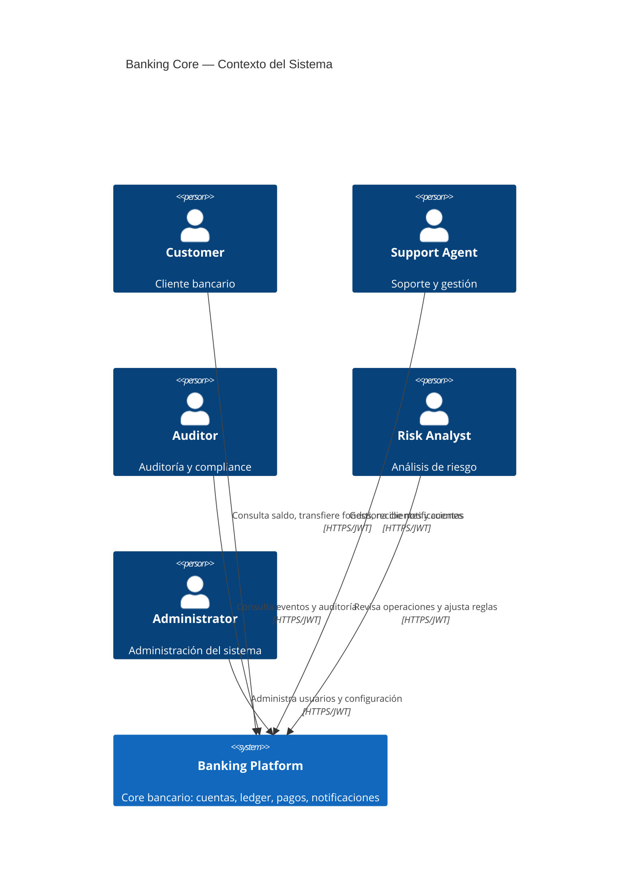

# C4 Nivel 1 — Diagrama de Contexto

## Actores

| Actor | Descripción |
|-------|-------------|
| **Customer** | Cliente bancario. Usa la web app o app móvil para consultar saldo, hacer transferencias. |
| **Support Agent** | Agente de soporte. Gestiona clientes, revisa cuentas, atiende incidencias. |
| **Auditor** | Auditor interno/externo. Consulta eventos, verifica integridad contable. |
| **Risk Analyst** | Analista de riesgo. Revisa operaciones marcadas, ajusta reglas. |
| **Administrator** | Administrador del sistema. Gestiona usuarios internos, configuración. |

## Diagrama

